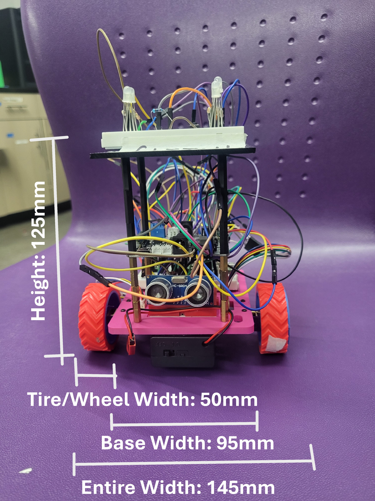
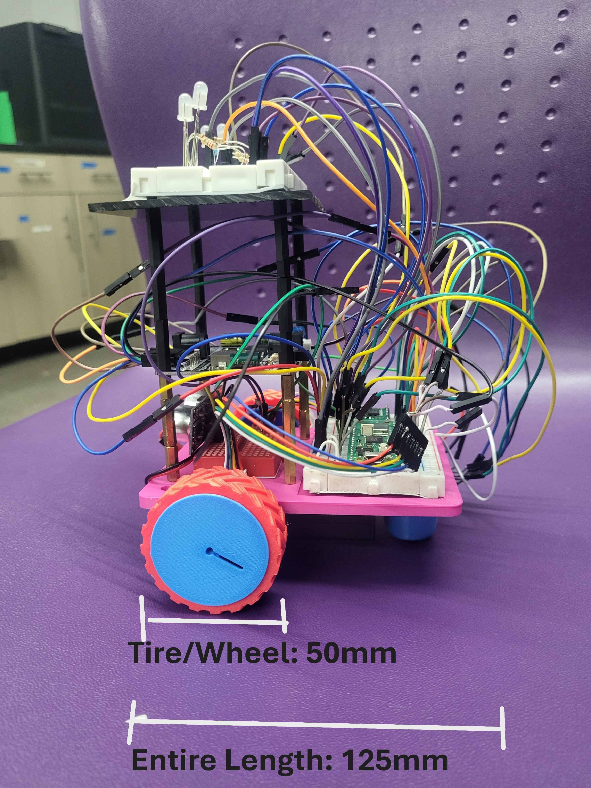
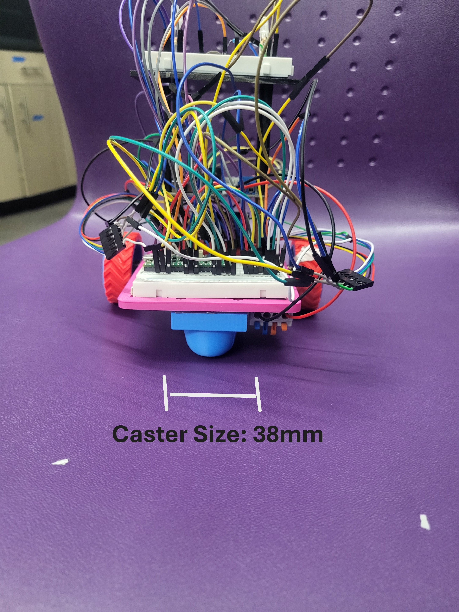
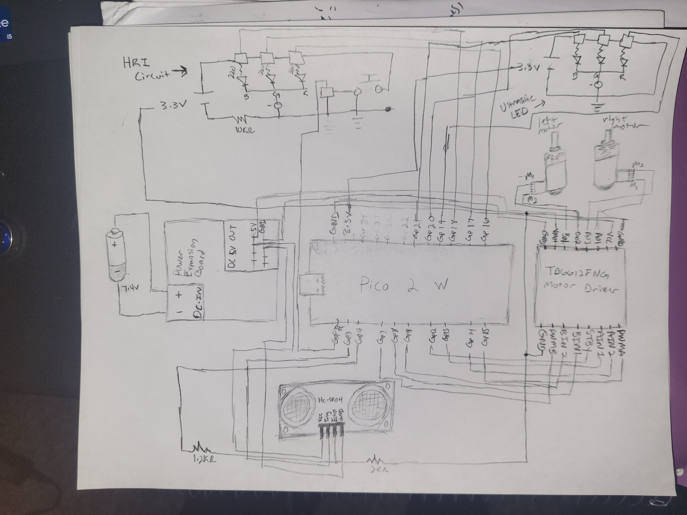

# Project 2: Wall Bouncer

## Background
[Roomba](https://www.irobot.com/en_US/roomba.html) is a very popular housekeeping robot. 
Despite the new technologies introduced to recent products, the "navigation" strategy of this robot can be fairly simple. 
Inspired by the Roomba, we are going to develop a robot that navigates/bounces in a closed cell. 
A human robot interface (HRI) from first project will be also integrated. 

## Requirements:
> [!IMPORTANT]
> Demonstrate your robot to Dr. Zhang to redeem your credits.

### 1. Assemble the Robot
Make sure every component is functional as expected.
Major required components are listed below:

| Name  | Qty. | Functionality
| ------------- | ------------- | ------------- |
| Mobile Base  | 1 | To host other physical components of the robot |
| 18650 Battery  | 2 | Power all the electrical and electronic components |
| Power Expansion Board | 1 | Converts 6~24V to 5V. Split input power. |
| Micro-GearMotor | 2 | Robot's actuator |
| Wheels | 2 | Attach to the motors and maneuver the robot |
| Raspberry Pi Pico | 1 | Send out and read in signals. Process and make decisions |
| TB6612FNG Motor Driver Board | 1 | Control motor speed following PWM signals |
| Ultrasonic Sensor | 1 | Sense distance to wall |
| Common Cathode LED  | 1 | Indicate robot's status |
| Tactile switch button  | 1 | Switch robot's working mode |

> [!WARNING]
> Off-the-shelf rubber tires and wheels are no long allowed (use 3D printed wheels and tires).

> [!TIP]
> Things you may want to check are listed but not limited below:
> - Have you double checked circuit and no short circuit anywhere?
> - Have you crimped connectors to motor wires?
> - Have you charged the batteries?
> - Are [Pico, LEDs and button](https://linzhanguca.github.io/_docs/robotics1-2025/0902/pico.pdf) functional?
> - Is [distance sensor](https://github.com/linzhangUCA/3421example-ultrasonic_sensor) functional?
> - Are [motor driver](https://github.com/linzhangUCA/3421example-motor_control) and motors controllable?
> - Are all the components fit into the bed? If not, print one from [here](https://github.com/linzhangUCA/3421example-robot_assembly/tree/main/prints).

### 2. (65%) Coding
- Program the Raspberry Pi Pico to: 
    - Encode robot's status into colors (`RED`, `GREEN`, `BLUE`) using LEDs .
    - Switch robot's behavior between `WORK MODE` and `PAUSE MODE` using a button.
    - **Read distance from ultrasonic sensor**.
    - **Send signals to motor driver board and move the robot according to the distance sensing**.
- Upload your script to this repository.
- Complete following tasks:
1. (3%) Initialization (System Check).
   - (2%) Blink all LEDs with frequency of 5 Hz, lasting 2 seconds when both conditions below are satisfied.
     - The button's GPIO pin is receiving correct default signal (`0` for `PULL_DOWN`, `1` for `PULL_UP`)
     - Ultrasonic sensor is receiving non-zero distance measuring.
   - (1%) The robot enters `PAUSE MODE` after this step.
2. (16%) When `PAUSE MODE` is activated:
   - (3%) `GREEN` LED fades in and fades out at frequency of 1 Hz (equally allocate fade-in and fade-out time).
   - (3%) Press the button to **immediately** switch to the `WORK MODE`.
   - (10%) Robot stop moving
3. (24%) When `WORK MODE` is activated:
   - (1%) `GREEN` LED stays constantly on.
   - (3%) Press the button to **immediately** switch to the **PAUSE MODE**.
   - (20%) Robot start moving without hitting the wall.
4. (20%) Low battery simulation.
   - (5%) If the accumulated `WORK MODE` time exceeds 45 seconds, substitute `GREEN` LED with **`BLUE`** LED for both modes (low-battery simulation).
   - (5%) If accumulated `WORK MODE` time over 55 seconds, blink `RED` LED at frequency of 10 Hz (`BLUE` and `GREEN` LED off).
   - (10%) If the accumulated `WORK MODE` time exceeds 45 seconds, Use 50% dutycycle of the original to be the robot's speed (Make sure the robot is still movable). 
5. (2%) Termination. Shutdown the system after the `RED` LED blinked 5 seconds.

> [!IMPORTANT]
> - It doesn't matter how your robot moves, but hitting a wall once during demonstration will cost 1% off your grade.
> - Plan a good strategy of wall avoidance.

> [!TIP]
> - Break tasks down into small pieces (the smaller the better). You may need write a handful of unit test scripts.
> - `print()` function and Python Shell are handy tools.

### 3. (35%) Documentation

#### 3.1. (15%) Mechanical Design: attach (multiple) technical drawings to illustrate dimensions and locations of the key components of the mobile base. 
- Denote dimensions of the bed.
- Denote dimensions and locations of the wheel assembly and the caster wheel.
- Denote locations of the mounting holes.
- Denote dimensions of the mounting holes.

> [!TIP]
> - You may want to checkout TechDraw of FreeCAD. Other CAD software should have the similar tools.  
> - Hand drawings are acceptable.

#### 3.2 (10%) Wiring Diagram: attach a drawing to illustrate electrical components' wiring.
- Specify power wires using red and black wires.
- Mark out employed signal pins' names.
- Electronic components' values have to match your actual circuit.

#### 3.3 (6%) Software Design
Use a [flowchart](https://en.wikipedia.org/wiki/Flowchart) or a [algorithm/pseudocode table](https://www.overleaf.com/learn/latex/Algorithms) or a [itemized list](https://docs.github.com/en/get-started/writing-on-github/getting-started-with-writing-and-formatting-on-github/basic-writing-and-formatting-syntax#lists) to explain your wall avoidance strategy.
Input: Ultrasonic Distance (d), Button State (b), Time (t)
Output: Motor Velocity (v), LED Color (c)
Parameters: 
    Safe_Dist = 0.25 m
    Retreat_Dist = 1.0 m
    Battery_Low_Time = 45 s

1:  Initialize Hardware (Motors, Sensor, LEDs)
2:  System Check:
3:      if Sensor.read() == Error then
4:          LED <- RED
5:          Halt System
6:      else
7:          Flash LEDs (White)
8:          State <- PAUSE_MODE

9:  Loop:
10:     d <- Sensor.get_distance()
11:     
12:     // Mode Switching
13:     if b is Pressed then
14:         Toggle State between PAUSE_MODE and WORK_MODE
15:
16:     // Low Battery Simulation
17:     if t_accumulated > Battery_Low_Time then
18:         Set Low Power Mode (Speed = 50%, LED = Blue)
19:
20:     // Main State Machine
21:     if State == WORK_MODE then
22:         switch Sequence_Step do:
23:             case FORWARD_1:
24:                 Motor.move(Forward)
25:                 if d < Safe_Dist then Step <- STOP_1
26:
27:             case STOP_1:
28:                 Motor.stop()
29:                 if Wait(1.0s) Complete then Step <- BACKWARD_1
30:
31:             case BACKWARD_1:
32:                 Motor.move(Backward)
33:                 if d > Retreat_Dist then Step <- STOP_2
34:
35:             case STOP_2:
36:                 Motor.stop()
37:                 if Wait(1.0s) Complete then Step <- FORWARD_2
38:
39:             case FORWARD_2:
40:                 Motor.move(Forward)
41:                 if d < Safe_Dist then Step <- STOP_3
42:
43:             case STOP_3:
44:                 Motor.stop()
45:                 if Wait(1.0s) Complete then Step <- BACKWARD_FINAL
46:
47:             case BACKWARD_FINAL:
48:                 Motor.move(Backward)
49:                 if d > 0.5m then State <- TERMINATE
50:
51:     else if State == PAUSE_MODE then
52:         Motor.stop()
53:         Fade Green LED
54:
55:     else if State == TERMINATE then
56:         Blink Red LED
57:         Shutdown System

#### 3.4 (4%) Energy Efficient Path Planning 
> The goal is using this robot to cover a rectangle-shape area.
> Do your research, make reasonable assumptions and propose a path pattern for the robot to follow.
> Please state why this pattern is energy efficient.
>
### 3.4 Energy Efficient Path Planning

**Proposed Pattern: The Boustrophedon (Lawnmower) Path**

To cover a rectangular area with maximum energy efficiency, I propose a **Boustrophedon path**, also known as a "Lawnmower" or "Zig-Zag" pattern.

**Path Description:**
1. The robot starts at one corner of the rectangle. 
2. It travels in a straight line to the opposite edge. 
3. Upon reaching the boundary, it makes a 90° turn, moves laterally by the width of the robot (or cleaning width), and turns 90° again to face the opposite direction. 
4. It traverses back across the area parallel to the first line. 
5. This repeats until the area is filled.

**Efficiency Analysis:**

* **Minimized Overlap:** 
    A random bounce strategy relies on probability to cover the floor, often traversing the same specific area dozens of times to reach a missed spot. Re-driving over covered areas wastes battery power. The Boustrophedon path covers each square foot exactly once (ideally), minimizing total distance traveled.

* **Reduced Turning Costs:** 
    Turning a differential drive robot often consumes more current than driving straight (due to friction against the turn). This pattern consists of long straight lines with minimal turns (only at the edges), whereas a spiral or random pattern involves constant, energy-consuming orientation changes.

* **Predictable Time:** 
    The energy required is a direct function of the area size ($Area / RobotWidth \times Speed$), allowing for precise battery management, whereas random coverage has a high variance in energy consumption to achieve 100% coverage.

